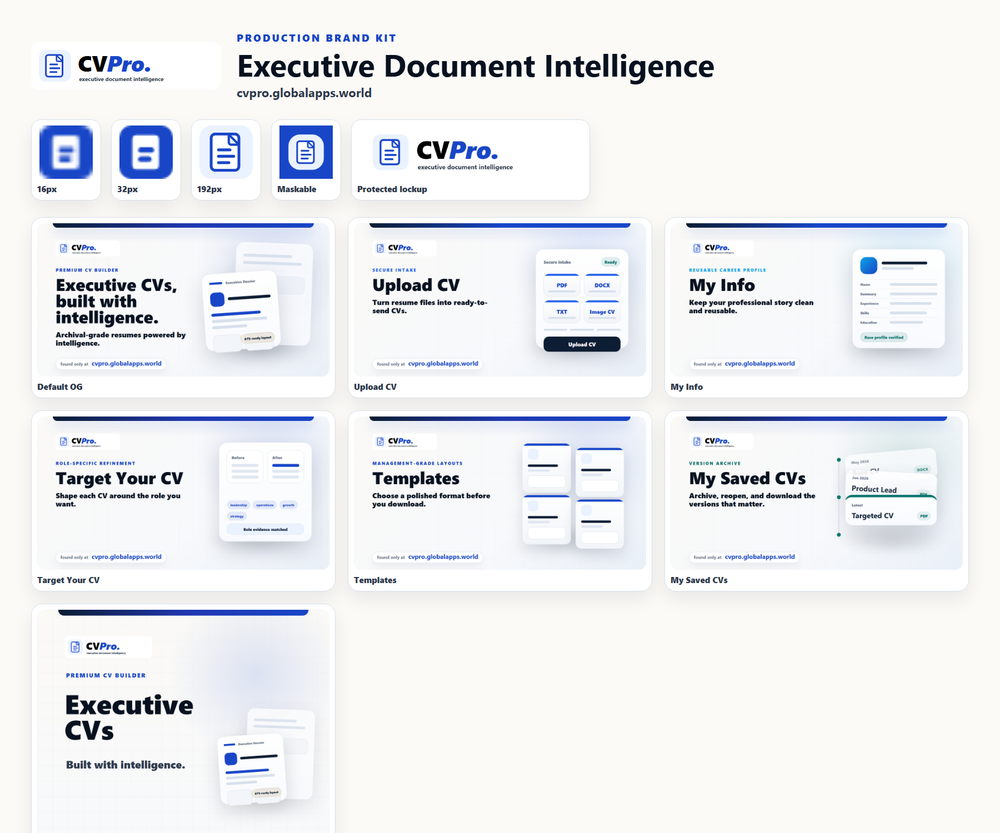
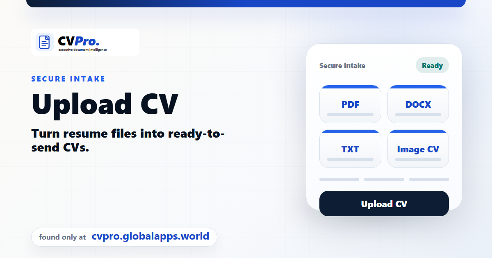
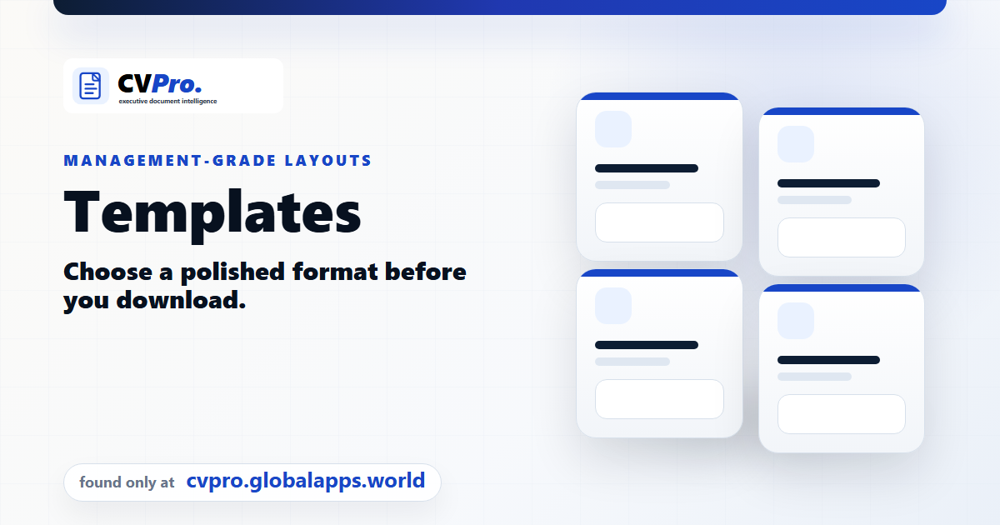
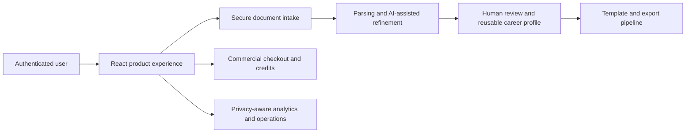

# CV Pro

> Commercial AI-assisted executive CV platform for turning career evidence into polished, role-targeted documents.

## Product overview

CV Pro is a live commercial web application designed around a practical problem: professional history is messy, job descriptions are specific, and producing a strong CV repeatedly is slow. The product combines secure document intake, reusable career information, AI-assisted refinement, management-grade templates, saved versions, and export workflows in one guided experience.

**Try the live product:** [https://cvpro.globalapps.world/](https://cvpro.globalapps.world/)

## Verified product capabilities

- Secure intake for PDF, DOCX, TXT, and image-based CVs.
- AI-assisted role targeting grounded in the user's supplied career evidence.
- Reusable “My Info” career profile for consistent document generation.
- Multiple polished CV templates and document export workflows.
- Saved CV history for reopening, comparing, and downloading versions.
- Authentication, credits, commercial checkout, analytics, and operational reporting.
- Production delivery through a containerized web service with CDN-aware verification.

## Product surfaces

| Secure intake | Management-grade templates |
| --- | --- |
|  |  |

## High-level architecture

The architecture deliberately keeps user review between machine assistance and the final professional document. Missing credentials and provider failures are surfaced explicitly rather than replaced with invented content.

## Engineering evidence

The private production repository contains a broad automated verification surface covering document parsing, upload recovery, image OCR flows, authentication UX, accessible dialogs, persistence, saved CVs, template fidelity, PDF export, pagination, payments, analytics, cloud configuration, static delivery, and release confidence.

This showcase intentionally documents outcomes and architecture without exposing commercially sensitive source code, operational identifiers, credentials, customer information, or deployment runbooks.

## Product maturity

- **Status:** live commercial application.
- **Public repository:** product and engineering showcase only.
- **Source availability:** private.
- **Claims boundary:** capabilities listed here are grounded in the production repository and committed verification tooling; no customer counts or performance metrics are claimed.

## Security

Please do not disclose suspected vulnerabilities through a public issue. See [SECURITY.md](SECURITY.md) for responsible reporting.

## Commercial source notice

Copyright © 2026 Nilhan de Mel. All rights reserved.

The screenshots and documentation in this repository may be viewed for product evaluation and portfolio review. They do not grant a license to the private CV Pro source code, product design, branding, or commercial implementation. See [NOTICE.md](NOTICE.md).

## Contact

- Product: [cvpro.globalapps.world](https://cvpro.globalapps.world/)
- WhatsApp: [+94 71 487 1888](https://wa.me/94714871888)
- Email: [nilhan.dev@gmail.com](mailto:nilhan.dev@gmail.com)

